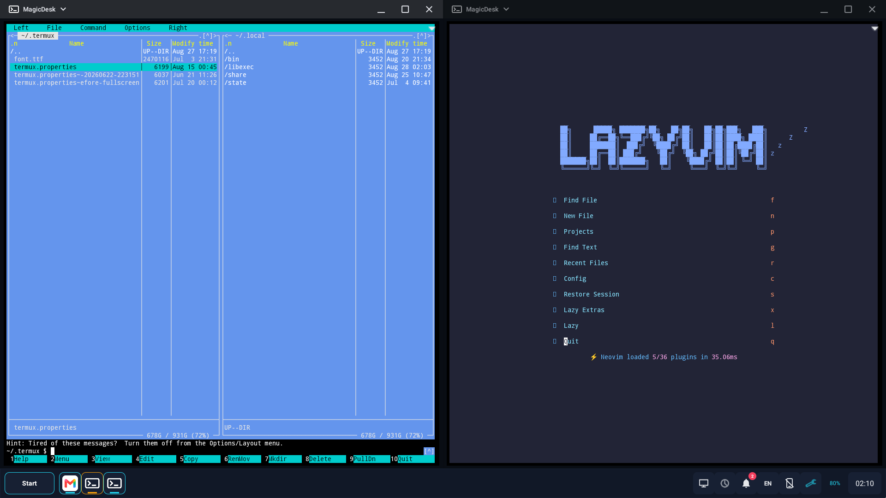

# MagicDesk

MagicDesk is an open-source workstation environment for Android 15 and newer.
It turns a phone, tablet, or Android secondary display into a practical desktop
with native application windows, a taskbar and Start menu, desktop files and
widgets, Files, Console, Task Manager, display capture, and physical keyboard
and mouse controls. When Termux is installed, MagicDesk can also run multiple
independent Termux shells and console applications as native Android desktop
windows.

Applications remain ordinary Android tasks managed by the system. MagicDesk
organizes them into one workspace and connects them to Android displays,
files, input, and an authorized shell identity. It does not stream
applications, embed them in replacement views, or run a guest operating
system.

The MagicDesk desktop uses one APK and one codebase across supported vendors.
Standard Android behavior forms the baseline; platform, display, and SoC
drivers add capabilities only when runtime probes verify them. Optional root
hardware helpers remain separate and are never desktop requirements.

> **Development note:** MagicDesk is a vibe-coded project, built primarily
> through [iterative AI-assisted development](docs/ai-assisted-device-porting.md)
> and hands-on testing on real Android hardware. Its privileged shell
> integration and optional undocumented vendor interfaces make independent
> source review especially important.

[Latest release](https://github.com/mekhontsev/magicdesk/releases/latest) |
[Development APK](https://github.com/mekhontsev/magicdesk/releases/download/development/MagicDesk-development.apk) |
[Community](https://t.me/magicdesk_android) |
[Compatibility](docs/compatibility.md) |
[Getting started](docs/getting-started.md)


## Why MagicDesk

### Native Android Desktop

MagicDesk works with real Android tasks and WMShell windows. Applications can
overlap, resize, snap, maximize, enter true fullscreen, move between displays,
and continue running in the background according to their normal Android
lifecycle.

### One Workspace Across Displays

The same desktop implementation runs on the phone, on a simulated development
display, or on a connected wired or wireless secondary display. Desktop
items, pins, shortcuts, widgets, recent applications, and live task layout can
follow the session while output mode, Fill display, and DPI remain specific to
each monitor.

### First-Class Multi-Window Termux

MagicDesk can open multiple independent Termux-backed Console windows. Each
window is a separate Android task with its own PTY, shell, working directory,
process lifecycle, saved geometry, and entry in the desktop task switcher.
Foreground programs such as `mc` and `nvim` appear by name in Open tasks and
can be switched, resized, snapped, minimized, and closed like native Android
applications.

These are not tabs inside the ordinary Termux activity, a single floating
overlay, or windows confined to an X11 desktop. They use the same terminal UI,
Files integration, drag and drop, Desktop Entry pipeline, and semantic MCP
controls as MagicDesk Console while executing the user's installed Termux
tools. Ordinary Termux and the separate Termux:X11 integration remain
available alongside them. See [Workstation tools](docs/workstation-tools.md)
for the execution and security model.

If `tmux` is installed inside Termux, the Termux Console toolbar can list its
persistent sessions on demand, attach one in another native Console window, or
create a named session that survives closing the window. MagicDesk does not
attempt to import ordinary Termux application tabs, and tmux is not required
for independent Termux Console windows.



### Built-In Workstation Tools

Files, Console, Task Manager, Settings, notifications, media controls, and
capture workflows are integrated with the desktop instead of being unrelated
utility applications. Files and Console use the authorized Android shell
identity, making the workspace useful without requiring a separate file
manager or terminal package. When Termux is installed, the same Console UI can
also host independent Termux PTYs and run its installed command-line tools.

### Semantic Automation

An optional local MCP server exposes typed desktop actions, state, events,
operation traces, visual observations, and interactive terminals. Android 16+
App Functions provide a smaller action set to authorized system agents.
Automation operates on MagicDesk concepts such as tasks, displays, windows,
and desktop items rather than depending only on synthetic screen coordinates.

## Capabilities

### Desktop Sessions And Windows

- Run the complete workspace on the phone, a simulated display, HDMI/USB-C
  output, or an already connected Miracast display.
- Launch applications in remembered Auto, Windowed, or Fullscreen modes.
- Snap, restore, minimize, close, focus, and move exact Android tasks.
- Switch tasks with `Alt+Tab`, use Show Desktop, and reach overflow tasks when
  the taskbar is full.
- Preserve still-running tasks, window modes, bounds, visibility, and stacking
  when a desktop closes or an external display disconnects.
- Use Start search, application quick actions, widgets, Android app
  information, taskbar pins, and desktop shortcuts.

### Workspace Tools

- Use `/storage/emulated/0/Desktop` as a real desktop folder with freely
  positioned files, folders, shortcuts, and Android widgets.
- Browse and modify the filesystem visible to the authorized shell identity in
  multiple Files windows, with list/grid views, search, selection, properties,
  drag and drop, and shared desktop context menus.
- Run independent interactive `/system/bin/sh` sessions in Console through a
  real PTY with ANSI color, alternate-screen applications, mouse reporting,
  selection, clipboard, and live resizing.
- Open multiple independent Termux-backed Console windows as native Android
  tasks, each with its own PTY, shell, working directory, process lifecycle,
  remembered bounds, and foreground-program label in Open tasks.
- Inspect and control running tasks in Task Manager, including CPU and memory
  indicators, exact-task focus and close, explicit force-stop, and a bounded
  per-application log viewer.
- Create bounded freedesktop-compatible `.desktop` entries for folders, web
  links, Android applications and shortcuts, Android shell commands, Termux
  commands, and Termux:X11 launch presets. Terminal applications created from
  Desktop, Files, or Console also appear in Start and can accept dropped or
  opened files through standard Desktop Entry arguments.

See [Workstation tools](docs/workstation-tools.md) and
[Desktop Entry files](docs/desktop-entries.md) for the complete behavior.

### Input, Media, And Platform Integration

- Use physical keyboards, mice, touchpads, right click, key repeat, keyboard
  layouts, and an optional phone touchpad and text-input panel.
- Capture the selected display and record video with automatic internal-audio,
  microphone, or no-audio selection according to detected capabilities.
- Control media volume and connected audio output from the taskbar.
- Select per-monitor DPI and, where supported, output resolution, refresh rate,
  and Fill display.
- Use optional platform features such as managed projection, phone-screen
  control, absolute pointer positioning, charging separation, cooling, and
  temperature readings without making them requirements for other devices.

### Automation And Validation

- Control sessions, tasks, windows, Files, Task Manager, settings, diagnostics,
  and interactive terminals through the local MCP server.
- Observe bounded state, events, operation traces, screenshots, and pixel
  samples for development and troubleshooting.
- Run a production-path self-test on phone, simulated, wired, or wireless
  targets to check window transitions, focus, captions, background visibility,
  task-stack invariants, and cleanup.
- Generate a privacy-bounded compatibility report containing firmware,
  displays, input devices, component-provider evidence, capability probes,
  runtime counters, structured MagicDesk errors, and a machine-readable
  summary suitable for onboarding unverified firmware.

See [Automation](docs/automation.md), [Architecture](docs/architecture.md), and
the [validation matrix](docs/testing-backlog.md).

## Requirements And Compatibility

MagicDesk requires:

- Android 15 / API 35 or newer;
- firmware with working Android freeform windows;
- the official Shizuku application with an authorized server running;
- one Device Setup pass and reboot before the first desktop session.

The Standard Android driver supports the phone desktop, the simulated desktop,
and secondary displays that Android already exposes. MagicDesk reports
Android's internal-display desktop resource as diagnostic evidence, but does
not use it as a launch restriction: vendor and shell windowing paths may still
work when that framework resource is false. External video output, Miracast,
application-task hosting, and physical input routing remain firmware
capabilities.

Nubia/REDMAGIC firmware has a separate platform extension for verified
projection, display-output, input, phone-screen, and hardware interfaces.
Other vendors continue through the standard driver; an unsupported optional
feature is disabled rather than blocking the desktop.

Passing the baseline check does not guarantee that every firmware implements
Android windowing correctly. See [Compatibility and issue reports](docs/compatibility.md)
for tested profiles, support levels, known limitations, and report contents.

## Quick Start

1. Install Shizuku from its
   [official releases](https://github.com/RikkaApps/Shizuku/releases), start its
   server through wireless debugging, ADB, or a deliberately configured root
   method, and confirm that it is running.
2. Install MagicDesk from the
   [latest release](https://github.com/mekhontsev/magicdesk/releases/latest) or
   the rolling [development APK](https://github.com/mekhontsev/magicdesk/releases/download/development/MagicDesk-development.apk).
3. Open MagicDesk and grant its Shizuku request.
4. Select **Prepare device**, review the capability results, and reboot when
   requested.
5. Restart Shizuku if required by its startup method, then open MagicDesk.
6. Select **Open desktop here** for the phone or **Start external desktop** for
   a connected secondary display.

Use **Close desktop** to retain still-running tasks for a later session. Use
**Exit MagicDesk** to discard the workspace, close MagicDesk windows, restore
owned runtime state, and stop its services.

The full installation, session, update, and removal workflow is in
[Getting started](docs/getting-started.md).

## Keyboard Shortcuts

| Shortcut | Action |
| --- | --- |
| `Win+D` | Start/reveal the desktop or restore the previous window layout |
| `Win+Up` | Move the active task to true fullscreen |
| `Win+Down` | Restore a fullscreen/maximized task; press again to minimize |
| `Win+Left` / `Win+Right` | Snap the active task to either half |
| `Alt+Tab` / `Alt+Shift+Tab` | Switch through exact Android tasks |
| `Alt+F4` | Close the active task |
| `Win+Backspace` | Send Android Back to the active display |
| `Win+L` | Lock the phone |
| `Win+N` | Toggle notifications |
| `Win+Q` | Toggle the System panel |
| `Win+I` | Open MagicDesk Settings |
| `Win+Print Screen` | Capture the active display |
| `Win+Shift+Print Screen` | Start or stop desktop recording |
| `Ctrl+Space` | Select the next configured keyboard layout |
| `Win+/` | Show all MagicDesk shortcuts |

## Security And Trust

Privileged operations run through one user-authorized Android shell service,
normally UID 2000 (`adb shell`) or UID 0 when the user deliberately starts
Shizuku with root. The effective identity and individual capabilities are
reported by Diagnostics. MagicDesk does not independently acquire elevated
privileges or silently fall back to application-UID behavior.

- The main APK contains no privilege-escalation path or kernel module.
- Files and Console show and use the connected shell identity. Applications
  opened from Files receive a temporary URI, not that identity.
- The MCP server is disabled by default, binds only to `127.0.0.1`, requires a
  private bearer token, and has separate developer and shell-access gates.
- Platform-specific commands remain behind capability and platform-driver
  boundaries.
- **Restore defaults** removes MagicDesk-owned persistent windowing overrides.

Read [Shell access and privilege modes](docs/privilege-modes.md),
[Automation](docs/automation.md), and [third-party notices](THIRD_PARTY_NOTICES.md)
before enabling privileged or automated workflows.

## Diagnostics

Open **Tools > Diagnostics** after reproducing a problem. Attach the complete
report, exact reproduction steps, and whether the problem survives a reboot to
a GitHub issue. Reports omit user files, accounts, notification contents, and
the installed-application list.

The self-test is a contributor and compatibility tool, not a substitute for
normal use on real firmware. Run it only while the phone is awake and unlocked
and no other MagicDesk desktop session is active. See
[Compatibility](docs/compatibility.md) and the
[validation matrix](docs/testing-backlog.md).

## Development

The project builds with JDK 17 or newer, Android SDK platform/build-tools 37,
and Android NDK `27.3.13750724`.

```sh
./gradlew verifyDevelopment
```

Every non-documentation push to `main` publishes a release-signed development
APK at the stable link near the top of this page. A `v*` tag runs the signed
release workflow and publishes the APK and SHA-256 checksum.

See [Contributing](CONTRIBUTING.md) for IDE setup, repository rules, build
variants, verification commands, and pull-request expectations.

## Documentation

- [Getting started](docs/getting-started.md)
- [Workstation tools](docs/workstation-tools.md)
- [Architecture](docs/architecture.md)
- [Automation and MCP](docs/automation.md)
- [AI-assisted device support](docs/ai-assisted-device-porting.md)
- [Desktop Entry files](docs/desktop-entries.md)
- [Shell access and privilege modes](docs/privilege-modes.md)
- [Compatibility and issue reports](docs/compatibility.md)
- [Fullscreen transitions](docs/fullscreen-transitions.md)
- [Validation matrix](docs/testing-backlog.md)
- [Nubia vendor interface audit](docs/nubia-vendor-audit.md)
- [Contributing and IDE setup](CONTRIBUTING.md)

## Project

- Author: [Dmitry Mekhontsev](https://github.com/mekhontsev)
- Community: [Telegram](https://t.me/magicdesk_android)
- Package: `io.github.mekhontsev.magicdesk`
- Minimum SDK: 35
- Target SDK: 37
- License: [MIT](LICENSE)
- Third-party components: [notices and licenses](THIRD_PARTY_NOTICES.md)
