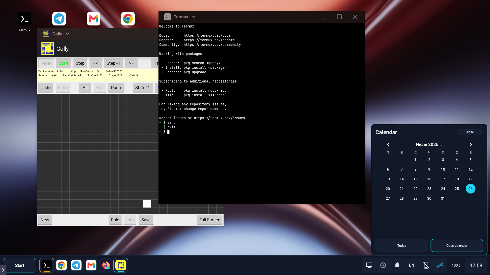
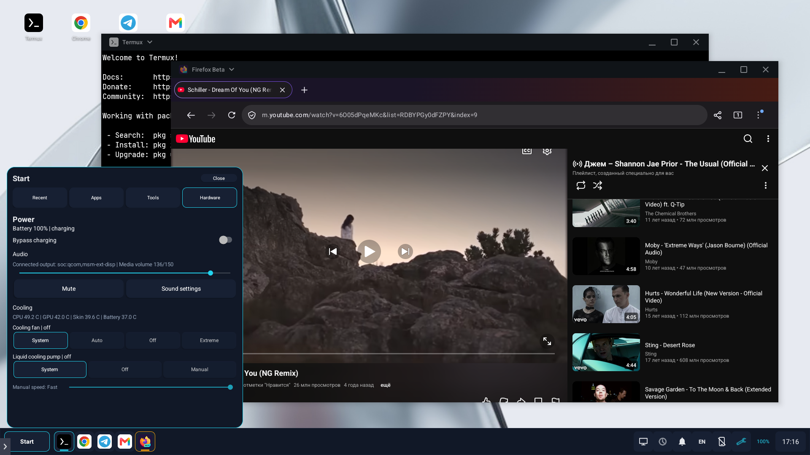

# MagicDesk

MagicDesk is an open-source, DeX-style desktop environment for REDMAGIC
devices. It turns REDMAGIC external-display support into a practical desktop
workspace with native Android windows, a taskbar, Start menu, desktop
shortcuts, global keyboard controls, notifications, and phone-based touchpad
support.

MagicDesk is intended to be the REDMAGIC counterpart to Samsung DeX. It is not
a port of DeX and is not affiliated with Samsung. It builds on Android's own
desktop window manager and the external-display services already present in
REDMAGIC firmware.

> **Development note:** MagicDesk is a vibe-coded project, built primarily
> through iterative AI-assisted development and hands-on testing on real
> REDMAGIC hardware. Its Shizuku integration and undocumented vendor interfaces
> make independent source review especially important.

> **Project status:** MagicDesk is under active development. The current
> firmware verification is limited to the REDMAGIC 11 Pro profile listed below.





## Why MagicDesk

REDMAGIC phones can drive an external display, but their stock interface does
not provide the complete desktop workflow available in Samsung DeX. MagicDesk
supplies that missing shell while continuing to use native Android tasks and
REDMAGIC's existing projection stack.

The result is a familiar desktop model:

- Android applications run in overlapping, resizable system windows with
  native WMShell decorations.
- A persistent taskbar tracks real Android tasks and pinned applications.
- Start, freely positioned desktop shortcuts, a global desktop folder, Android
  widgets, task switching, and Show Desktop provide normal mouse-driven
  navigation.
- DeX-style global shortcuts manage windows without application-specific
  configuration.
- The phone can remain available as REDMAGIC's touchpad and text-input panel.
- Fullscreen applications and in-app fullscreen video use the entire external
  display.

MagicDesk does not emulate Android applications, host them inside custom views,
or replace Android's task organizer. Applications remain ordinary Android
tasks managed by Android's ActivityTaskManager, WindowOrganizer, and WMShell.

## Highlights

### Desktop workspace

- Launch applications in Windowed or Fullscreen mode.
- Keep multiple overlapping windows visible and switch exact tasks from the
  taskbar or with `Alt+Tab`.
- Minimize windowed applications without pausing them, so media and background
  work can continue behind the desktop.
- Send an existing task between the phone and active external desktop from its
  context menu without restarting the application.
- Snap windows left or right, maximize them above the taskbar, or enter true
  fullscreen.
- Pin applications to the taskbar or place shortcuts on the desktop.
- Use `/storage/emulated/0/Desktop` as the normal desktop filesystem: create,
  open, rename, and delete files or folders directly from the desktop.
- Add native Android widgets, move them on the desktop, and resize supported
  providers from their context menu.
- Preserve the last visible freeform window layout across Show Desktop.
- Keep desktop files, widgets, pins, shortcuts, and recent applications global
  while storing DPI and desktop/window geometry separately for each monitor.
- Use the phone's current static wallpaper, center-cropped for the active
  display.

### Desktop controls

- Start menu with application search and keyboard navigation.
- Open Tasks view with exact-task focus and close controls.
- Right-click context menus in MagicDesk and ordinary applications.
- Notification center with unread state, actions, dismissal, and transient
  notification popups.
- Calendar panel, battery state, active keyboard-layout indicator,
  phone-screen control, screenshots, and configurable external-display
  recording with internal audio.
- Media-volume, connected audio-output, and REDMAGIC Touch Panel controls.
- Stock REDMAGIC bypass-charging, cooling-fan, liquid-pump, and temperature
  controls through the vendor's own policy services.
- Automatic external-desktop startup and window-layout restoration through
  `Win+D`.

### Physical input

- Native key repeat and physical keyboard layouts on the external display.
- `Ctrl+Space` cycles through layouts exposed to Android by the active input
  method as enabled keyboard subtypes, in system order. An IME that exposes
  only one subtype cannot provide system-wide physical-keyboard switching.
- `Alt+Tab` bypasses REDMAGIC's broken system Recents path while ordinary
  `Tab`, `Shift+Tab`, and `Ctrl+Tab` remain normal application input.
- Right click reaches Chrome, Firefox, MagicDesk, and other applications
  instead of being converted to Android Back by REDMAGIC firmware.
- Mouse hot-plug and multiple external keyboard or touchpad devices are
  handled without recreating the virtual devices or restarting applications.

## Requirements

MagicDesk is intentionally REDMAGIC/ZTE-specific and requires:

- a ZTE, nubia, or REDMAGIC device running Android 16 / API 36 or newer;
- the official Shizuku application with its server running;
- a one-time Device Setup and reboot to enable Android desktop windowing.

Using the desktop on an external display additionally requires USB-C
DisplayPort output and REDMAGIC external-display support. **Open desktop here**
can run the same desktop implementation on the device display without either.

MagicDesk does not run in a reduced fallback mode when Shizuku is stopped or
permission is denied. All privileged operations use the same Shizuku
UserService path, keeping runtime behavior predictable and reviewable.

**Currently verified:**

- REDMAGIC 11 Pro (`NX809J`)
- Android 16
- Firmware fingerprint:
  `REDMAGIC/NX809J-EEA/NX809J:16/BQ2A.250705.001-BP2A.250605.031.A3/20260204.221845:user/release-keys`

Other models and OTA versions are treated as unverified. They can continue
after an explicit warning so compatibility reports can identify missing or
changed vendor hooks. Passing the baseline check does not guarantee every
feature works on different firmware.

See [Compatibility and issue reports](docs/compatibility.md) before reporting a
device-specific failure.

### Install and start Shizuku

1. Install Shizuku from the
   [official GitHub Releases](https://github.com/RikkaApps/Shizuku/releases).
2. Start its server using one of the methods supported by the official app.
3. For the standard wireless-debugging method, enable **Developer options**:
   open **Settings > About phone** and tap **Build number** seven times, then
   enable **Wireless debugging**. In Shizuku, select pairing through Wireless
   debugging. In Android's
   **Wireless debugging** screen, choose **Pair device with pairing code**,
   enter that code through the Shizuku notification, then press **Start** in
   Shizuku.
4. Confirm that Shizuku reports a running server before opening MagicDesk.
   Wireless-debugging and ADB startup must be repeated after every reboot;
   root-started Shizuku follows its own startup configuration.

Use the [official Shizuku setup guide](https://shizuku.rikka.app/guide/setup/)
for device-specific pairing and startup details.

## Getting Started

1. Complete **Install and start Shizuku** above and confirm that its server is
   running. Starting it from a computer through ADB is also supported.
2. Install MagicDesk from a tagged
   [GitHub Release](https://github.com/mekhontsev/magicdesk/releases) or build
   it from source.
3. Launch MagicDesk on the phone and allow it through Shizuku.
4. Press **Prepare device**. MagicDesk applies its app-specific permission and
   desktop-windowing configuration through Shizuku.
5. Reboot when requested. Android and WMShell cache part of the desktop
   configuration during startup.
6. Launch MagicDesk manually after reboot. It has no boot receiver and starts
   no service until the user opens it.

Notification access is optional. Grant it from Android settings to enable the
MagicDesk notification center and notification popups.

### Uninstalling

Before uninstalling MagicDesk, open **Device Setup > Restore defaults**, then
restart the phone. Android does not allow MagicDesk to perform this cleanup
automatically while it is being uninstalled.

If MagicDesk has already been removed, reinstall it, grant Shizuku access, run
**Restore defaults**, and restart. The action does not depend on saved setup
history. It removes the desktop-windowing overrides and resets the primary
display size, density, and scaling to the defaults supplied by nubia.

### Typical workflow

1. Connect the phone to an external display.
2. Optionally connect a physical keyboard, mouse, or combined touchpad device.
3. Launch MagicDesk on the phone.
4. Select **Start external desktop**, or press `Win+D`.
5. To leave, select **Switch to screen mirroring**. Select **Exit MagicDesk**
   instead to stop MagicDesk and its background services completely.

The initial external-display DPI is selected from the display resolution; for
1920-pixel-wide displays the recommendation is `160`. The DPI can be adjusted
under **Start > Tools** and is remembered per monitor. **System** removes the
MagicDesk density override.

### Phone notification

MagicDesk keeps a persistent notification while it is running. It is useful
when no physical keyboard or mouse is connected:

- Tap the notification itself to perform the same context-sensitive action as
  `Win+D`: start the external desktop, show it, or restore the previous layout.
- Tap **Open touchpad** to launch or reopen REDMAGIC Touch Panel on the phone.

The full desktop can also run on display 0 through **Open desktop here**, which
supports tablets and allows development without an external monitor.

## Keyboard Shortcuts

| Shortcut | Action |
| --- | --- |
| `Win+D` | Start the external desktop, show it, or restore the previous window layout |
| `Win+Up` | Move the active task to true fullscreen |
| `Win+Down` | Restore fullscreen/maximized task to a window; press again to minimize |
| `Win+Left` / `Win+Right` | Snap the active task to either half of the desktop |
| `Alt+Tab` / `Alt+Shift+Tab` | Switch forward or backward through real Android tasks |
| `Alt+F4` | Close the active task |
| `Win+Backspace` | Send Android Back to the active display |
| `Win+L` | Lock the phone |
| `Win+N` | Toggle the notification center |
| `Win+Print Screen` | Save the active display under `Pictures/Screenshots` |
| `Win+Shift+Print Screen` | Start or stop external-display recording with internal audio; save under `Movies/MagicDesk` |
| `Ctrl+Space` | Select the next configured physical-keyboard layout |
| `Win+/` | Show all MagicDesk shortcuts |
| `Escape` | Act as normal Escape in the active app and dismiss transient cross-application UI |

The unmodified Win key is deliberately unused. The taskbar language indicator
cycles the same configured layouts as `Ctrl+Space`.

## Privileges And Trust

MagicDesk uses the official `dev.rikka.shizuku` UserService API for external
desktop sessions, native task control, display density, screenshots,
phone-screen dimming, locking, wallpaper access, vendor cooling and bypass
charging, and physical input routing. MagicDesk does not independently acquire
elevated privileges.

The trust boundaries are deliberately narrow:

- The complete source and CI workflow are reviewable under the MIT license.
- The main APK declares no Internet permission and contains no independent
  privilege-escalation path, kernel module, or kernel-module loader.
- Shizuku is never downloaded, installed, or started by MagicDesk. The user
  controls the official manager and grants MagicDesk separately.
- The connected UserService identity is included in Diagnostics; every
  supported Shizuku startup method uses the same commands and feature set.
- The diagnostic Console executes only commands entered and confirmed by the
  user. Those commands are not restricted to MagicDesk's internal allowlists
  and have the effective privileges displayed by the Console.
- MagicDesk changes only the four desktop settings documented under Device
  Setup. **Restore defaults** removes those overrides instead of guessing
  firmware values. The REDMAGIC property writer accepts only two hardcoded
  boolean/absent desktop properties.
- The system `ShellTaskOrganizer` remains the only task organizer.
- `libmagicdesk_uinput_bridge.so` and
  `libmagicdesk_keyboard_bridge.so` are rebuilt from their C sources in every
  build; no prebuilt input helper is checked in.
- Lifecycle-bound streams make input and display guards fail open: losing the
  APK or Shizuku releases grabbed devices and restores display power.
- Device and firmware mismatches are reported through structured Diagnostics
  codes instead of silently assuming compatibility.

Implementation details are in [Architecture](docs/architecture.md), the
runtime and display contract is in
[Shizuku and display modes](docs/privilege-modes.md), and verified firmware
behavior is recorded in the
[Nubia vendor interface audit](docs/nubia-vendor-audit.md).

## Diagnostics And Issues

Open **Tools > Diagnostics** to generate a copyable compatibility report. It
contains device and firmware identity, display/input information, desktop
settings, capability probes, recent structured MagicDesk errors, and
MagicDesk-only logcat entries. It excludes user files, accounts, notification
contents, and the installed-application list.

**Diagnostics > Console** runs one-off shell commands through the authorized
Shizuku service. It shows the effective UID, requires confirmation before its
first command, and does not retain command history.

Include the report, exact reproduction steps, and whether the problem survives
a reboot when filing an issue.

## Build

Install JDK 17, Android SDK platform/build-tools 37, and Android NDK r27 or
newer. If Gradle cannot locate the SDK, create an untracked
`local.properties`:

```properties
sdk.dir=/absolute/path/to/android-sdk
```

Build the debug APK:

```sh
./gradlew :app:assembleDebug
```

On Termux, install `clang`; the build uses `$PREFIX/bin/clang`. On conventional
Linux, set `ANDROID_NDK_HOME`. The native input helpers are compiled from
`native/magicdesk_uinput_bridge.c` and
`native/magicdesk_keyboard_bridge.c`.

## Releases And Signing

GitHub Actions lints and builds MagicDesk on every change. A `v*` tag runs the
signed release workflow, verifies the APK contents and certificate, publishes
its SHA-256 checksum, and creates a GitHub Release.

Official release APKs use this certificate SHA-256 fingerprint:

```text
3A:F3:FE:F8:95:AC:BC:9C:B7:7B:FD:BB:7E:91:79:42:
95:70:72:14:97:E3:6E:C1:E4:19:68:C9:4B:52:99:50
```

Maintainer signing setup and encrypted CI secret names are described in
[Architecture](docs/architecture.md#build-and-release-boundaries).

## Technical Documentation

- [Architecture](docs/architecture.md)
- [Shizuku and display modes](docs/privilege-modes.md)
- [Fullscreen transitions](docs/fullscreen-transitions.md)
- [Compatibility and issue reports](docs/compatibility.md)
- [Deferred validation backlog](docs/testing-backlog.md)

## Project

- Main package: `io.github.mekhontsev.magicdesk`
- Minimum SDK: 36
- Target SDK: 36
- License: [MIT](LICENSE)

Samsung DeX is a trademark of Samsung Electronics. Its name is used here only
to describe the desktop-product category and interaction model.
