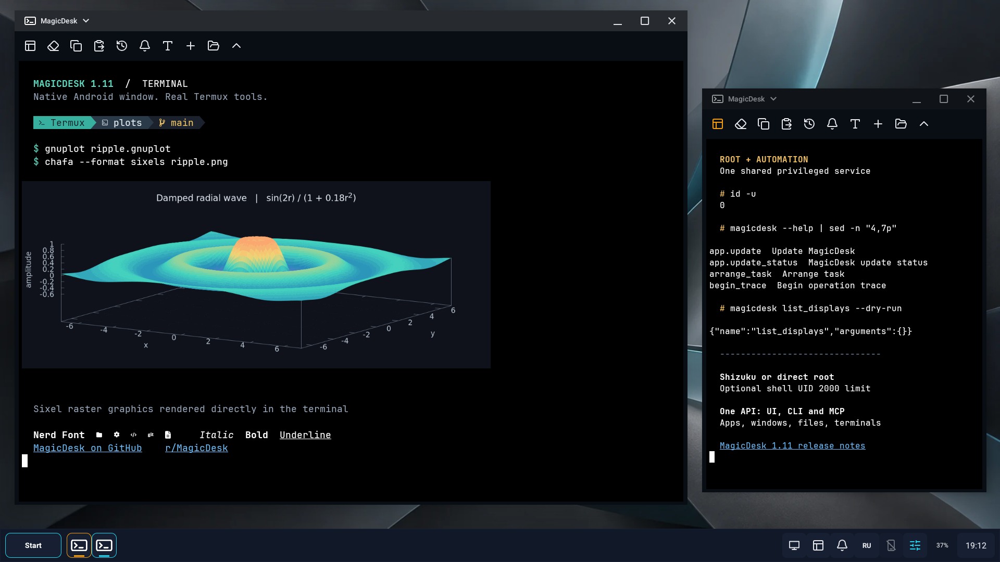
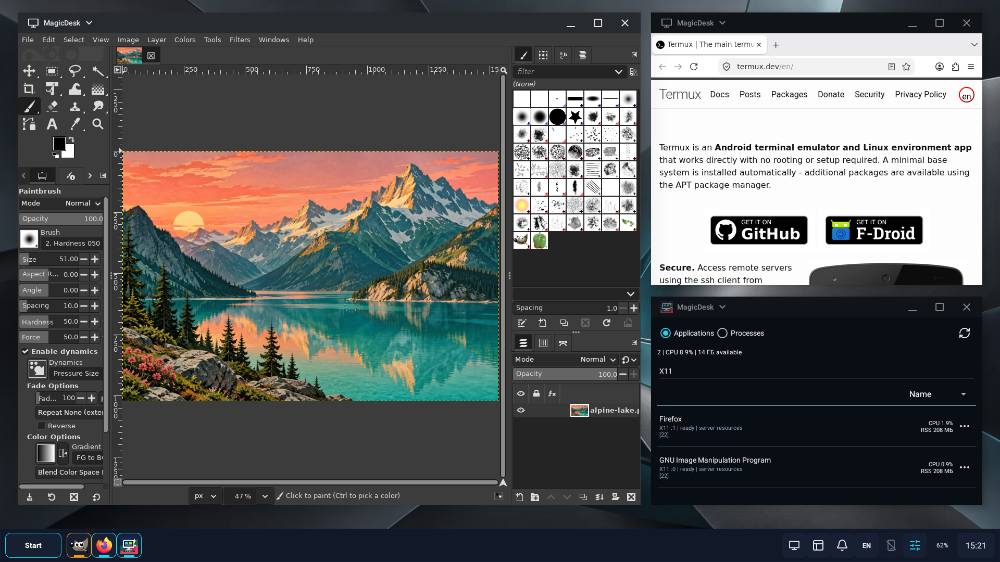

# MagicDesk

**An open-source Android workstation.**

MagicDesk combines **native Android app windows, Linux graphical applications,
full-featured terminals and independent desktops on multiple displays**. Add a
real file-based desktop, per-app interface scaling and programmable automation,
and your phone becomes a workstation. Work on its own screen, on external
displays, or from a computer through scrcpy.

Run Android apps, Termux X11 applications and command-line tools side by side.
Move content between Files, terminals and Android apps. Let an authorized AI
client use the same services you use interactively. Desktop is one way to work
with these tools, not a requirement for using them.

The APK requires **Android 14+**. Managed **Desktop requires Android 15+**.
For privileged features, use [Shizuku](https://github.com/RikkaApps/Shizuku) on an unrooted device, or
**direct root without Shizuku** on a rooted one. Both start the same privileged
service. Root is optional, and root users can limit that service to Android's
shell UID 2000. **Termux terminals and X11 applications also work without Shizuku,
root or a Desktop session**, on the phone or an Android-allowed secondary display.

[Latest release](https://github.com/mekhontsev/magicdesk/releases/latest) |
[Development APK](https://github.com/mekhontsev/magicdesk/releases/download/development/MagicDesk-development.apk) |
[Getting started](docs/getting-started.md)

**Join the community: [Reddit r/MagicDesk](https://www.reddit.com/r/MagicDesk/) |
[Telegram](https://t.me/magicdesk_android)** |
[Support bot](https://t.me/MagicDeskSupportBot)

This documentation describes the current development code. The stable APK may
not yet include every feature below.


## One Connected Workspace

MagicDesk's strength is how its parts work together:

- **Each screen can have its own desktop.** Keep a workspace on the phone and
  another on an external or virtual display. Each has its own windows, taskbar
  and Start. Launch apps on a chosen screen, move running tasks, and close one
  Desktop without closing the others. A [portable workspace](#portable-workspaces-and-parking)
  keeps its apps on a virtual display while you disconnect or change monitors.
- **Linux graphical apps join the workspace.** Launch installed Termux apps
  such as GIMP and Firefox from Start into separate windows alongside Android
  apps. Or open a complete Linux desktop from a configured proot/chroot
  environment. The X11 server is built in; no separate Termux:X11 APK is needed.
- **A terminal worth using on its own.** Run Android shell, root shell or
  Termux tools in independent windows with a bundled Nerd Font, clickable
  links, Sixel/Kitty images, touch scrolling and a unified terminal/tmux picker.
  Use it on the phone without opening Desktop, or beside your Android apps.
- **Android apps get room to work.** Keep a browser, editor, file manager and
  terminals in separate native windows, with task switching, keyboard shortcuts
  and [per-app DPI](#per-app-dpi).
- **Files connect the tools.** The desktop is a real folder. Files, clipboard,
  drag and drop, Android sharing and command launchers work with the same
  content, so a file can move from a terminal workflow to an Android app without
  a separate export workspace.
- **Commands become applications.** A Termux or shell command saved as a
  `.desktop` file appears in Start, can accept dropped files and, with declared
  MIME types, becomes an **Open with** handler in Files. One definition serves
  all three entry points.
- **Work is not tied to an open desktop.** Files and terminals also run on their
  own. Close Desktop without ending retained terminal sessions, then reattach
  their windows. A virtual display can remain available to scrcpy independently
  of the desktop session.
- **The workspace is programmable from AI or shell scripts.** Authorized MCP
  clients can inspect state, manage windows, work with files and terminals, invoke Android actions and
  compose workflows through the same services as the UI. Automation can also
  run without Desktop, locally or over an explicitly enabled network connection.
  The built-in `magicdesk` CLI exposes the same command catalog without requiring
  an MCP server, Python or Termux.

During an external desktop session, the phone remains useful in its own right:
run a second Desktop, keep an ordinary app launcher, or use the phone as a
touchpad with your normal Android keyboard for an external app.

## Native Android Desktop

Applications remain real Android tasks, with native captions, input, rendering
and application lifecycle owned by Android and WMShell.

The core is vendor-independent: windows, input, displays, files and automation
use shared Android mechanisms, including hidden framework APIs through the privileged service.
Optional firmware and SoC adapters add focused capabilities to the same
implementation. You keep your Android applications, system keyboard and Termux
environment.

- Use Desktop on the phone, a wired monitor, an Android wireless display, or a
  MagicDesk-created virtual display. Several displays can run their own Desktop
  at the same time, with independent windows and Start menus.
- Resize, snap, maximize, restore and move tasks between displays. True
  fullscreen is separate from a maximized freeform window.
- Switch exact tasks with the taskbar, overview and Alt+Tab through one window
  controller. Selecting a task does not recreate its Activity.
- Use Start search, app actions, pins, shortcuts, widgets, notifications,
  media controls and capture tools.
- Set display density and [per-app DPI](#per-app-dpi). Per-app scale
  follows the managed task across window modes and is released on return to
  ordinary phone use.
- Keep a real Desktop folder with files, folders and editable `.desktop`
  launchers, plus bundled or custom wallpaper.

MagicDesk acquires Android's HOME role when the first Desktop starts and returns
the previous role state after the last one closes. A phone without its own
Desktop has an ordinary Start surface: it launches phone apps in fullscreen and
lists phone recent tasks. Each Desktop Start remains independent and can be
open at the same time. Every Start has a display selector beside search:
**Current** launches on its own screen; another selection sends apps there.
The same Start is available through **Apps** even with no Desktop running.
Choose app-default placement, a Desktop window, Desktop fullscreen, or an
independent fullscreen app; request a new window where the app supports it.
Independent apps stay outside Desktop's taskbar and Alt+Tab, even on a screen
with an active Desktop. Opening an app does not redirect the keyboard or mouse;
input routing has its own control.

Close records the selected workspace and releases its surviving applications
as independent fullscreen tasks on the same live display, leaving other
Desktops running. If the display disappears, its tasks return to the phone.
A later session can restore the same still-live tasks, not applications that
Android or the user has closed. Closing Desktop does not remove its display.


### Per-App DPI

**Give each Android app its own interface scale, not one compromise for the
whole screen.** Make a browser or file manager more compact to fit more content,
while keeping another app's text and controls larger. Other applications and
the taskbar keep their own scale. This changes the app's Android density, not
the monitor resolution or just the zoom of one web page.

Open an app's context menu in Desktop and choose **Application settings**.
Select **Custom** and adjust **Interface scale** from **50% to 200%** of the
display's density. Lower values make the interface smaller; higher values make
it larger. **System** removes the app-specific override. Saved custom profiles
are also available under **Settings > Application profiles**.

The setting applies to running managed windows and is remembered for later
Desktop sessions. It follows the app through freeform, snap, maximize and true
fullscreen, using the selected display's density as its baseline. When the app
returns to ordinary phone use, or Desktop closes, MagicDesk removes the active
density override without forgetting your saved Desktop preference.

Apps still choose their own layouts: reducing DPI can give an adaptive app
more logical space, but cannot create a tablet interface it does not implement.
Per-app DPI is a managed Desktop feature, not a system-wide override for an
app outside MagicDesk's session.

## Tools Without Desktop

Open **Apps** from Phone Control Panel to launch Files, other applications or a
terminal on the phone or a selected display. No Desktop setup is needed: tools use ordinary fullscreen
Activities outside a managed session and the existing window controller inside
one. Opening a tool does not acquire HOME.

### Files And Content

Files browses the filesystem available to the authorized shell identity.
It supports multiple windows, search, selection, copy, move, rename, delete,
properties, file handlers, Android document import, and drag and drop.

Files, Desktop, Console, Android clipboard and View/Share intents share one
content model. External apps receive scoped content-URI access to selected
files, never MagicDesk's shell identity. **Save to MagicDesk Desktop** accepts
Android shares after confirmation. File operations do not require Desktop.

The default workspace is `/storage/emulated/0/Desktop`. Display changes do not
create another Desktop folder. Profile-qualified app identities are implemented
in catalogs and state; full work-profile and Private Space support is not yet
implemented.

### A Full Terminal, With Or Without Desktop

MagicDesk's terminal is an interactive PTY, not a command-output panel. Run
editors, file managers, terminal dashboards and CLI agents with ANSI colors,
scrollback, terminal mouse reporting and alternate-screen support. Android-shell
and Termux sessions share the same renderer, controls and automation API.



*A gnuplot chart rendered through Sixel in a Termux-backed terminal, beside an
optional root console running the built-in `magicdesk` CLI.*

- **Bundled Nerd Font:** JetBrains Mono with regular, bold and italic faces,
  aligned box drawing and Powerline symbols. Adjust font size per window with
  settings, pinch or Ctrl+wheel.
- **Graphics inside the terminal:** static Sixel and inline Kitty images,
  including Kitty placeholders through tmux. Preview an image next to command
  output, then **Save in Files**, **Open** or **Share** it through Android.
- **Shell integration:** clickable OSC 8 links, window titles, notifications,
  progress and shell-marked command history. Supported shell hooks let you
  revisit a command and copy its output without selecting the whole transcript.
- **Phone-friendly interaction:** smooth local scrollback and kinetic touch
  scrolling, selection handles, a layout that resizes for the on-screen
  keyboard, and **Copy as paragraph** to join unwanted terminal line breaks
  when copying prose.
- **One session picker:** retained Android-shell and Termux terminals alongside
  discovered tmux sessions. Create, attach, rename, detach or explicitly end a
  session from Phone Control Panel or any console toolbar.
- **Quick return:** the runtime notification's **Terminal** action reopens a
  retained terminal, including when no Desktop is running.

Application-controlled scrolling, including tmux, is smoothed when its redraws
describe a coherent scroll. Other updates retain normal terminal behavior;
MagicDesk does not require application-specific scrolling hooks.

Closing an ordinary terminal window detaches the view and retains its shell and
programs. Closing a managed tmux window detaches its client; tmux keeps its server
session and programs. **Close Desktop** does not end retained terminals. Local
PTYs do not survive MagicDesk process death or APK replacement; independently
running tmux sessions can be attached again.

Android-shell terminals use the connected service's shell or root identity.
Termux terminals use **Termux's own UID, packages and shell configuration**, with
its documented external-command permission. Termux and tmux are optional;
neither is required for the ordinary Console.

Multiple Termux-backed windows are ordinary Android tasks, not tabs inside the
Termux app or windows confined to an X11 server. MagicDesk cannot import an
ordinary Termux tab's PTY.


See [Workstation tools](docs/workstation-tools.md) and
[terminal integration](docs/terminal-integration.md) for setup, supported
protocols and limits, and [Desktop Entry files](docs/desktop-entries.md) to turn
commands into launchers.

### Task Manager

See Android applications, retained terminals, tmux and X11 sessions in one
**Applications** list. Switch to **Processes** for CPU and resident-memory use,
process trees and a Termux filter. Sort by name, CPU or memory, find a busy
process, return to its window or end a session explicitly. Available process
details and actions depend on the connected service's permissions.

## Linux Applications Through Termux

**Run Linux graphical applications beside Android apps, not just inside one
large Linux desktop window.** MagicDesk embeds its own Termux:X11 fork and
presents individual X11 application windows as Android tasks. GIMP and the
Termux version of Firefox can run simultaneously, each with its own window,
taskbar entry and X session. No separate Termux:X11 APK or Linux window manager
is needed for this mode.



*GIMP, the Linux build of Firefox and MagicDesk Task Manager running together
on one desktop. Both graphical applications are supplied by Termux.*

### Installed Apps In Start

1. Enable Termux external commands and grant MagicDesk its `RUN_COMMAND`
   permission, as described in [setup](docs/getting-started.md).
2. Install `xkeyboard-config` and the graphical applications you want in Termux.
3. Open **Start** and search for the application. MagicDesk reads Termux's
   installed `.desktop` launchers whenever Start opens; no manual launcher is
   needed for applications that provide one.

Choose the destination display and window mode using the same Start controls
as Android apps. Mouse, keyboard, clipboard, app titles and icons are
integrated. Windows show the application content without an extra MagicDesk
toolbar. Launching again returns to the existing window; **New window** requests
another session, subject to the application's own instance/profile rules.
Recent remembers Android and X11 launch recipes without accumulating duplicate
entries, and can relaunch an X11 command after its previous session ends.

Copy text, HTML, PNG images and files between Android and X11 applications.
Drag-and-drop supports copying between compatible Android/X11 windows and
between separate X11 sessions. The receiving application must support the
offered format; container-private file paths need shared storage or bindings.
See [clipboard and drag-and-drop](docs/x11.md#clipboard-and-drag-and-drop) for
the supported formats and limits.

X11 scale follows the host display's density. Adjust an app's **Interface scale**
from **50% to 200%** in its Start context menu, or adjust a session in the X11
manager. Linux toolkits retain their own scaling behavior; some applications
need a restart to pick up a density change.

### Whole Linux Desktops Too

Use the **X11** tool to create and manage multiple retained sessions, run a
window manager or launch a configured proot/chroot Linux desktop. Open the whole
desktop in one window, or choose individual clients through **X11 windows**.
A custom `.desktop` launcher can bring that environment into Start as well.
In **New command app**, choose **Linux (Termux)** and an installed `proot-distro`
environment or a custom entry script for prepared chroot/other environments.
Create a terminal, X11 application or Linux-desktop launcher, optionally choosing
the Linux user and working directory. User shortcuts can be deleted from Start.
Leave the terminal command empty for a Linux login shell in MagicDesk Console.
MagicDesk supplies the X server and windows; Termux and your container setup
supply the programs. It does not install or configure a Linux distribution for you.

With authorized **Root** access, **Linux (Shell / root)** launchers can use a
prepared chroot without Termux at all: the same Console, individual X11 windows
or whole Linux desktop. Provide an entry script and, for graphics, the guest's
XKB data path. See [chroot setup](docs/x11.md#chroot-without-termux).

Closing a whole-session viewer keeps its Linux session running; **Stop X11
session** ends it. Closing an individual app window requests the app's normal
close action, including any save confirmation. **Close Desktop** ends neither
kind of X11 session: its surviving windows become independent fullscreen tasks.

Termux applications and proot do not require root, and X11 can run on the phone
without managed Desktop. A chroot environment needs its own privileged setup.
Graphics retain upstream AHardwareBuffer/EGL support, with optional Vulkan
acceleration for supported buffer paths and a CPU-copy fallback where needed.
See [Embedded X11](docs/x11.md) for setup, container launchers and current limits.

## Shizuku Or Direct Root

**Rooted devices can use MagicDesk without installing or running Shizuku.**
Choose **Settings > Integrations > Privileged service > Root (su)**, reopen
MagicDesk and authorize it in your root manager. The control panel shows
**Access: shell / root / none** for the actual connected identity and provides
the authorization entry point, even without Desktop.

This is one service with two startup methods, not separate versions of the app.
Files, Console, displays, input and automation use the same implementation.
With root access, Files and Android-shell terminals can reach paths and perform
operations allowed to that identity; Termux sessions still run as Termux.

**Settings > Limits (next app start)** sets **Maximum access** to **Root**, **Shell**
(default, UID 2000) or **App only**. Root allows the selected launcher's identity
but never elevates a shell launcher; Shell also restricts root-backed Shizuku and
direct root. App only never requests privileged access, while authorized Termux
terminals and X11 remain usable. Independent switches can disable **Termux
integration** or **Managed Desktop** without changing installed apps or permissions.
Limits and backend changes apply after Exit and reopen, never halfway through a session. See
[Privilege boundaries](docs/privilege-modes.md).

## MagicDesk On A Computer With scrcpy

Use MagicDesk together with **scrcpy** to view and control the Android workspace
from a computer. Desktop and applications execute on the Android device;
scrcpy supplies the computer-side display and input connection. A physical
monitor is not required: create a MagicDesk virtual display and view that
existing display with scrcpy.

The same arrangement can show independent fullscreen Files or terminal tools
without starting managed Desktop. scrcpy is a separate application with its
own connection requirements; an MCP connection does not provide its video stream.

Run on the computer, replacing `3` with the display ID shown in MagicDesk
(`0` is the phone screen):

```sh
scrcpy --display-id=3 --mouse-bind=++++ --shortcut-mod=rctrl
```

This views an existing display, without creating or owning it. The mouse and
shortcut options leave right-click and Alt/Super combinations for Android.
See the [scrcpy documentation](https://github.com/Genymobile/scrcpy#user-documentation)
for installation and USB/Wi-Fi connection setup.

## Displays And Portable Workspaces

Phone Control Panel lists built-in, wired, wireless and MagicDesk-created
displays in one table, with their IDs, dimensions, Desktop state and Viewer
connections. Select a row to act on that screen. Each display can have its own
Desktop or simply host independent fullscreen apps; starting or closing one
Desktop does not start or close the others. A wireless connection can already
exist before MagicDesk starts Desktop on it.

**Create display** offers a virtual display or a display with a phone preview,
with configurable dimensions and scale, initially based on the selected screen.
Multiple headless virtual displays can coexist; the Android preview adapter has
a single shared configuration. Display settings are remembered, and a virtual
display keeps its own configuration when shown on another output.

### Portable Workspaces And Parking

A **direct Desktop** lives on the Android display exposed by the monitor or
wireless receiver. A **portable Desktop** lives on a MagicDesk virtual display;
the monitor only shows it through a fullscreen Display Viewer. This separates
the workspace from the cable: applications keep their Android display ID and
stay on the same virtual screen when the output disconnects.

For example, keep GIMP, a browser and terminals open between monitors:

1. Select the connected HDMI or wireless output and choose **Start portable
   desktop here**. MagicDesk uses a suitable virtual display or creates one,
   starts Desktop there, and shows it on the selected output.
2. Open your applications on that virtual Desktop and work normally.
3. Unplug the monitor, disconnect casting, or choose **Stop showing** on the
   output. The virtual Desktop and its applications remain running: this is
   parking, not **Close Desktop**.
4. Connect a monitor again, select it, choose **Show another display...**, and
   pick the existing virtual display by its name and ID. Continue the same
   workspace without relaunching or transferring its applications. Use
   **Control input** on the source display when you want to direct your
   phone-connected keyboard and mouse there.

Start with a portable Desktop for this workflow: unplugging a direct Desktop's
physical screen does not convert it into a parked virtual one. Parking is a
live session, not a saved machine image; keep MagicDesk running and do not use
**Close desktop**, **Remove display** or **Exit MagicDesk** to park it.

### Viewing And Switching Screens

Select an output and choose **Show another display...**, then pick the source
by name, ID and Desktop status. This opens its independent fullscreen Viewer
or changes the source in the existing one. **Stop showing** closes that fullscreen
Viewer while retaining the source display, its applications and Desktop.
The HDMI or wireless connection itself stays connected. This step is not
required before unplugging a cable or switching sources. Select another output
and the same source to continue there. **Start desktop** automatically uses a
portable workspace on public external displays that Android does not mark as
trusted for direct Desktop hosting. **Display Viewer**
opens from Start like other built-in applications: choose its destination and
window mode there, then select the source inside the Viewer. It mirrors without
taking over an output Viewer; several Viewer windows can show the same source.

During Desktop, **Ctrl+Alt+Tab** switches what the current output shows and
routes keyboard/mouse input to the selected source together. Applications stay
on their original displays; this is display switching, not window migration.
Ordinary Viewer opening is view-only and does not claim input routing.

A viewer, display and Desktop session have independent lifetimes:

- Closing a viewer does not close Desktop or remove MagicDesk's display.
- **Close desktop** stops the session but keeps its display.
- **Remove display** removes only a MagicDesk-owned display, after closing any
  session on it and completing cleanup.
- MagicDesk does not remove physical, wireless, built-in or foreign virtual
  displays. Their connection is managed by Android and the external device.

Display creation and ordinary tool placement do not require WMShell Desktop.
Android 14 execution coverage remains pending; additional built-in screens on
dual-screen/foldable devices are not yet verified Desktop targets.

## Automation

The optional MCP server exposes the same services used by the UI:

- Device, runtime, display and task state, events and exact-operation waits.
- Desktop lifecycle, task focus, window transitions and semantic UI actions.
- Independent tool placement and retained terminal control.
- Discovery and launch of Desktop and Termux `.desktop` entries, including X11
  applications, with or without a managed Desktop.
- Android intents, handlers, shortcuts, Activity results and App Functions.
- Screen capture, clipboard and notification operations.
- Rectangular screenshots and scoped Android UI inspection with element bounds,
  actions and waits, without requiring Desktop.
- File upload/download with bounded chunks and integrity checks.
- Same-package, same-signer MagicDesk APK updates, with an installer worker
  that survives replacement and allows the client to reconnect.
- Desktop self-tests with exact run IDs, live stages, results and cleanup state.

MCP can start before the privileged service is ready. Each command checks its own service
prerequisites; a reachable server is not proof that Desktop or shell operations
are available. Desktop commands still require Desktop where applicable.

Loopback and optional network listeners have separate tokens and grants.
The complete tool catalog stays visible when permissions change, so an AI client
does not need to reload its catalog merely because a grant was enabled.
Android 16+ App Functions expose a smaller system-agent action surface.

The built-in `magicdesk` CLI brings the same commands to shell scripts in
MagicDesk Console and Termux Console. Its options and help come from the shared
command catalog, and execution uses the same services as MCP. It works without
Desktop, an enabled MCP server, Python, or an installed Termux app when using
the ordinary Console.

Scripts can ask for text, confirmation or a choice through Android dialogs, and
post notifications with buttons or inline replies. Responses return through the
same CLI/MCP commands, so a build script can offer to open its output folder or
ask a question without keeping the terminal in front. CLI `--field` extracts a
result field without an external JSON parser.

Command output can also stream directly into a retained terminal or tmux PTY,
including terminal graphics, without an intermediate file. This shares the
terminal output stream; a running full-screen application may redraw over it.

See [Automation and MCP](docs/automation.md) for configuration, permissions,
transfer/update protocols and test control.

## Downloads

**[Latest release](https://github.com/mekhontsev/magicdesk/releases/latest)**
is the place to start for regular use. It contains the latest numbered official
release, its APK and release notes. Read the notes to see what changed and which
limitations apply; the rest of this README may also describe features still in
development.

**[Development APK](https://github.com/mekhontsev/magicdesk/releases/download/development/MagicDesk-development.apk)**
is the rolling build of `main`, published after its required CI checks pass.
Use it to try unreleased features and fixes before the next numbered release.
It uses the regular MagicDesk package and release signing certificate, not the
separate MagicDeskTest identity, and may be less stable than a numbered release.
Include its full version from Diagnostics when reporting a problem.

## Requirements And Setup

The APK requires **Android 14+**; managed **Desktop requires Android 15+**.
The native helpers currently target ARM64. Android 14 device validation is
pending. Windowing capabilities, external video support and firmware behavior
vary by device; see [tested coverage and limitations](docs/compatibility.md)
and the [API-level contract](docs/runtime-api-levels.md).

| Use | Requirements beyond installing the APK |
| --- | --- |
| Control panel, Settings, MCP observation | Ordinary app access; explicitly enable MCP for clients |
| Display inventory and interactive app launches | Ordinary app access; Android must allow the selected app on that display |
| Files, Android shell, privileged capture and device actions | An authorized privileged service and the operation's actual capabilities |
| Termux terminals | Termux, external commands enabled, MagicDesk's `RUN_COMMAND` permission |
| Linux graphical applications and desktops | Termux integration with `xkeyboard-config`, or authorized root with a prepared chroot/entry script and XKB data; no standalone Termux:X11 APK |
| Owned virtual displays | An authorized privileged service and working framework display APIs |
| Managed Desktop | Android 15+, an authorized privileged service, Desktop setup, working framework windowing |
| Wired/wireless output | Hardware and firmware that expose a usable Android secondary display |

The integrations are independent: **Termux only** provides terminals, tmux and
X11 on the phone or an Android-allowed secondary display; **shell/root only** provides Files, Android-shell terminals,
device automation and display control; **root** can additionally enter prepared
chroots in Console or X11 without Termux. Enable both integrations to combine them. Managed
Desktop adds window management on Android 15+; it is not a prerequisite for
the independent tools. Android 14 device coverage remains pending.

1. Install MagicDesk and open Phone Control Panel.
2. For privileged features, start Shizuku and authorize MagicDesk, or select
   **Root (su)** in **Settings > Integrations**, reopen MagicDesk and approve the
   root request. Termux is optional and has its own permission setup.
3. Use **Apps** for Files and other applications. Its **Terminal sessions** entry
   creates or opens Android-shell, Termux and tmux terminals without Desktop.
4. For Desktop, open **Settings > Device setup**, complete the required changes,
   and reboot only when setup requests it. Restart Shizuku afterward as needed.
5. Find the phone, a connected display, or one created through **Create display**
   in the display table, then press **Start desktop** in the shared toolbar.

**Apps** opens fullscreen Start to launch an app or move a running task to its
selected display, without requiring Desktop. Every Start offers **Current** or
an explicit display, an app-default, Desktop window, Desktop fullscreen or
independent launch, and an optional new-window request. Independent applications
stay outside Desktop's taskbar and Alt+Tab; the control panel lists them per display.
Without privileged access, the display table and **Apps** remain available for
interactive launches and saved **Recent** entries. Android decides which apps
may open on each display. Moving existing tasks between displays, live Android
task management and background MCP placement still require shell/root access.
**Control input**
selects where phone-attached mice and keyboards operate independently.

**Show desktop** returns to the selected workspace without starting another
session. **Close desktop** closes only that workspace while keeping other
Desktops, the tools runtime and owned displays available. Its applications remain
on that display as independent fullscreen tasks; if the display disappears, they
return to the phone. **Exit MagicDesk** also ends retained terminals and X11
sessions, releases owned displays, closes built-in windows and stops the
runtime. Neither action deletes the Desktop folder.

**[Getting started](docs/getting-started.md)** is the step-by-step guide from
installation to your first workspace. It explains Shizuku authorization,
independent Files and terminal tools, Termux permissions, display creation and
Desktop setup, as well as closing, updating and removing MagicDesk. Use it when
you need the actual setup sequence rather than the feature overview here.
[Compatibility](docs/compatibility.md) separates standard support, device
observations and optional vendor controls.

## Input And Optional Features

Physical mice and keyboards stay Android input devices, explicitly associated
with the selected input display, with or without Desktop. Android handles
acceleration, layout, repeat, hover and right click. MagicDesk's key-only Accessibility service handles
desktop shortcuts only during the session.

The optional phone touchpad supplies one virtual relative mouse. The user's
normal Android IME connects directly to a focused external editor; MagicDesk
does not capture editor text, choose a replacement IME or relay it through a
vendor text bridge.

**Show keyboard on app display**, available in Settings and the taskbar's
context menu, requests the on-screen keyboard beside the app instead of on the
phone. This is useful with XR glasses or a distant monitor while the phone
serves as a touchpad. Keyboard placement still depends on the IME and Android's
display policy.

Output timing, phone-screen power, charging separation, cooling, thermal
readings and internal recording audio depend on separately probed capabilities.
Unsupported optional features do not disable unrelated tools or Desktop.
Shared compatibility policies can be selected in Settings on every vendor.

## Keyboard Shortcuts

These actions also have pointer controls. Right-click an application's taskbar
icon for **Window > Arrange** (halves and quarters) or **Restore window**.
Right-click empty taskbar space for **Back in application** or **Switch display...**,
which switches the picture and input together. **Quick controls** includes
**Lock device**; **Start > Tools** includes **Keyboard shortcuts**. The keyboard
indicator offers hardware layouts separately from on-screen keyboards.

| Shortcut | Action during Desktop |
| --- | --- |
| `Win+D` | Show bare desktop or restore its previous window layout |
| `Win+Up` | Move the active task to true fullscreen |
| `Win+Down` | Restore fullscreen/maximized task; press again to minimize |
| `Win+Left` / `Win+Right` | Snap to either half |
| Hold `Win` after Left/Right, then `Up` / `Down` | Move between top corner, half and bottom corner |
| `Alt+Tab` / `Alt+Shift+Tab` | Switch exact tasks |
| `Ctrl+Alt+Tab` | Switch the displayed screen and its input together |
| `Alt+F4` | Close active task |
| `Win+Backspace` | Send Android Back to the desktop display |
| `Win+L` | Lock phone |
| `Win+N` / `Win+Q` | Notifications / Quick controls |
| `Win+I` | MagicDesk Settings |
| `Win+Print Screen` | Capture desktop |
| `Win+Shift+Print Screen` | Start/stop recording |
| `Ctrl+Space` | Next configured physical-keyboard layout |
| `Win+/` | All shortcuts |

## Security

Found a potential vulnerability? Use [private security reporting](https://github.com/mekhontsev/magicdesk/security/advisories/new),
not public issues or the support bot. See the [security policy](SECURITY.md).

Authorization through Shizuku or root applies to privileged operations, not
every UI action. Files and Android-shell terminals use the connected service's
identity; Termux uses its own.
Root users can select **Root (su)** in **Settings > Integrations** instead of
running Shizuku. **Limits > Maximum access > Shell** also restricts root-backed
Shizuku; **App only** disables privileged startup entirely. Settings take effect
on the next app start. This limits the working service, not the app's root-manager grant.
MagicDesk does not patch SystemUI or load a kernel module.

MCP is disabled by default and requires a bearer token. Each listener has
independent permissions for control, input/tests, content, file reads, file
writes, shell/terminals and APK updates. Authenticated observation is always
available. Shell and input grants allow broad device control, not a sandbox
limited to their neighboring permission categories.

Network MCP uses HTTP, not TLS. Enable it only on a trusted network or through a
protected VPN/tunnel; do not expose it directly to the Internet. Grant only the
access the client needs. Accepted actions may continue after a grant is revoked.

See [Privilege boundaries](docs/privilege-modes.md) and
[third-party notices](THIRD_PARTY_NOTICES.md).

## Community And Support

**[r/MagicDesk](https://www.reddit.com/r/MagicDesk/)** is the public subreddit
for MagicDesk discussions, announcements and user setups. Share your workspace,
compare experiences across devices, ask questions or propose improvements.
Each topic has its own discussion thread, so other users can find and build on
the same conversation.

**[Telegram community](https://t.me/magicdesk_android)** is the shared place
for release announcements, questions, device experiences and workflow ideas.
Use it to discuss how you use MagicDesk and what you would like to improve.
The support bot below is a separate private conversation for a specific report
and its follow-up questions; posting on Reddit or in the Telegram community
does not submit a bot case.

### AI-Assisted Support

**Report a problem and try a proposed fix from the same Telegram chat.**
[MagicDesk Support Bot](https://t.me/MagicDeskSupportBot) connects your
diagnostics to an AI-assisted development loop: GitHub Copilot can investigate
the report, ask follow-up questions and propose code changes. When a candidate
build succeeds, the bot sends you a **MagicDeskTest APK** to try. Send the
results back to continue the same case, without building the app yourself or
needing a GitHub account.

Join the [Telegram community](https://t.me/magicdesk_android), open the bot
privately, and follow `/start`. Send the complete Diagnostics report and steps
to reproduce, then `/submit`. Answers and test results also need `/submit`;
`/status` shows progress and what to do next.

Each APK comes with links to its exact source, changes and GitHub build, plus
its SHA-256. Sources and builds are published in the separate
[MagicDeskTest repository](https://github.com/mekhontsev/magicdesk-test-builds).
Follow the commit link in your APK message to inspect the proposed patch and
the sources for that particular build; the repository's `main` is the shared
test baseline, not your individual candidate. These are experimental support
builds, not another official release channel.

Reports and conversations go to a private support lab, but generated source
can contain report details: **do not send secrets or personal files**.

The service is experimental and processing capacity is limited. Test APKs use
a separate package and signing key; they are not official releases or verified
fixes. Installation is manual; merging a patch into MagicDesk requires
maintainer review. Do not run regular and test Desktop sessions together.
See [Telegram support](docs/telegram-support.md) for the steps, privacy and
testing precautions. [GitHub issues](https://github.com/mekhontsev/magicdesk/issues)
remain available for conventional bug reports.

## Diagnostics And Development

Reproduce a problem, open Diagnostics, and attach its complete compatibility
report and exact steps to a [bot case](docs/telegram-support.md) or GitHub issue.
Reports omit user files, account data, notification contents and the installed-app
catalog, but logs can contain filenames and package names: review before sending.
Self-tests are explicit, interactive checks, not background monitoring or a
universal firmware guarantee.

The project uses JDK 17+, Android SDK/build-tools 37 and NDK
`27.3.13750724`, plus the embedded X11 build tools listed in
[Contributing](CONTRIBUTING.md#build-environment):

```sh
git submodule update --init --recursive
./gradlew verifyDevelopment
```

Host builds do not replace device testing. Native helpers are currently ARM64;
API 34 native validation and other ABIs remain in the
[validation plan](docs/testing-backlog.md).

> **Development note:** MagicDesk is a vibe-coded project, built primarily through
> [iterative AI-assisted development](docs/ai-assisted-device-porting.md)
> and hands-on device testing. Independent review is especially important for
> privileged framework integration.

## Documentation

- [Getting started](docs/getting-started.md)
- [Workstation tools](docs/workstation-tools.md)
- [Terminal integration](docs/terminal-integration.md)
- [Embedded X11 and Linux applications](docs/x11.md)
- [Architecture](docs/architecture.md)
- [Automation and MCP](docs/automation.md)
- [Runtime API levels](docs/runtime-api-levels.md)
- [Compatibility and issue reports](docs/compatibility.md)
- [Telegram support and test builds](docs/telegram-support.md)
- [Desktop Entry files](docs/desktop-entries.md)
- [Fullscreen transitions](docs/fullscreen-transitions.md)
- [Privilege boundaries](docs/privilege-modes.md)
- [Validation plan](docs/testing-backlog.md)
- [Contributing](CONTRIBUTING.md)

## Project

- Author: [Dmitry Mekhontsev](https://github.com/mekhontsev)
- Community: [Reddit](https://www.reddit.com/r/MagicDesk/) and
  [Telegram](https://t.me/magicdesk_android)
- Package: `io.github.mekhontsev.magicdesk`
- Minimum APK SDK: 34; managed Desktop: 35
- Target SDK: 37
- License: [GNU GPLv3](LICENSE); see [licensing and source availability](docs/licensing.md).
